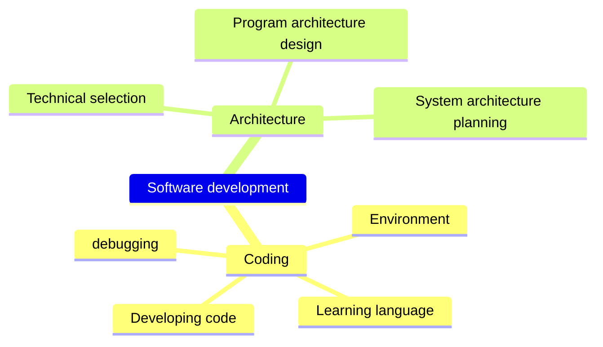

+++
title = "Coding with AI"
weight = 2
+++

## Concept
When developing programs, we need to do many things, including setting up the environment, learning languages, writing code, testing, and debugging. 
These tasks require a lot of time and effort, but if we make good use of artificial intelligence (AI) technology, we can speed up the process.

For example, AI can help us automatically generate code, optimize code, and debug automatically, all of which can significantly improve our development efficiency and quality. 
At the same time, AI technology can also assist us in architecture planning, selecting the most suitable technologies and frameworks to improve system stability and reliability.

## Mindmap

## Tree List of Examples
- Coding
  - Environment setup
    - Example: `How to pass command line arguments for Golang debugging in VS Code`
  - Learning language usage
    - Learning language features
      - Example: `Using code to explain Golang's workspace, module, package, internal package`
    - Using standard library
      - Example: `How to use Golang to save a string to a file`
    - Examples of package usage
      - Example: `Using Goldmark to parse a markdown string and traverse a tree-like list`
  - Developing code
    - Writing code snippets
      - Example: `Using Golang to recursively traverse a directory and copy files to another directory`
    - Optimizing code
      - Example: `How to optimize the memory usage in this code snippet`
    - Understanding and explaining code content
      - Example: `Explaining the main logic of this code snippet`
    - Write regex
      - Example: `Write a regex to parse a CSV file that is separated by commas, but some columns have data with commas surrounded by double quotes`
  - Testing and debugging
    - Write test case
      - Example: `Write 5 test cases for a Golang command line program with 2 parameter, first parameter must in A, B, C, second parameter must is int`
    - Debugging error messages
      - Example: `What is the reason for this error message, and how to resolve it: cannot use x (type []int) as type []interface {} in argument to foo`
    - Debugging code snippets
      - Example: `Why is this code snippet failing to read a file?`
- Architecture planning
  - Technical selection
    - Example: `Recommended package for parsing markdown in Golang`
    - Example: `Comparing Goldmark and Blackfriday`
    - Example: `Which Golang package should I use to read markdown and use custom tags?`
  - Program architecture design
    - Example: `An example of Golang program architecture should include a main program, shared components, private components, configuration files, and handling of multilingual data.`
  - System architecture planning
    - Example: `Designing a highly available Golang website, what factors should be considered`

# Advanced learning
You can learn and review advanced software development knowledge that can be used by asking AI.
Example
- [Design Pattern](https://learninfun.github.io/learn-with-ai/ai-knowledge-hub/it/back-end-development/design-pattern/)
- [Algorithm](https://learninfun.github.io/learn-with-ai/ai-knowledge-hub/it/back-end-development/algorithm/)
