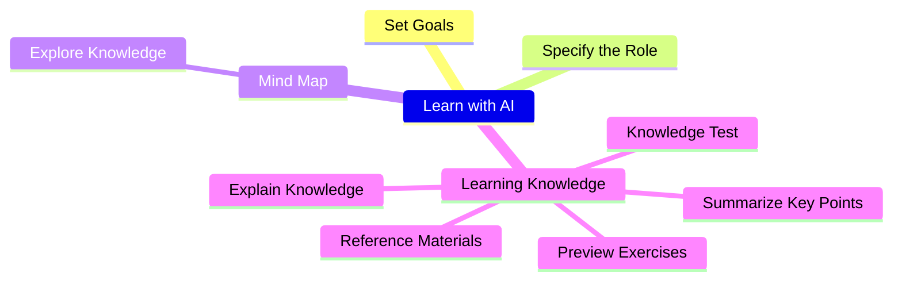

+++
title = "Learn knowledge with AI"
weight = 1
+++

## Summary

ChatGPT is a powerful language model that can answer your questions, provide valuable knowledge, and even serve as an assistant in learning new skills. However, how can you systematically use ChatGPT to learn a subject? Here are some simple and practical methods to help you make the most of ChatGPT for learning more efficiently.

## Mindmap

## Command list
- Specify the Role: `Assuming you are an [AA] expert, please answer my questions.`
- Explore Knowledge: `List knowledge points about [AA].`
  - Expand: - `List knowledge points about [AA.BB].`
  - Auto Expand: `Generate a non-repetitive tree structure of knowledge points about [AA], and expand it to the 5th level.`
- Learning Knowledge
  - Preview Exercises: `Give me 5 questions about [OO].`
  - Explain Knowledge: `Explain [OO] and provide an example.`
  - Summarize Key Points: `List the key points of [OO].`
  - Knowledge Test: `Give me 5 medium-difficulty questions about [OO], and provide the answers at the end.`
  - Reference Materials: `Provide me with 5 online resources about [OO].`

## Command list example
- Specify the Role: `Assuming you are an "Marketing" expert, please answer my questions.`
- Explore Knowledge: `List knowledge points about "Website Marketing".`
  - Expand: - `List knowledge points about "SEO".`
  - Auto Expand: `Generate a non-repetitive tree structure of knowledge points about "Website Marketing", and expand it to the 5th level.`
- Learning Knowledge
  - Preview Exercises: `Give me 5 questions about "Keyword research".`
  - Explain Knowledge: `Explain "Keyword research" and provide an example.`
  - Summarize Key Points: `List the key points of "Keyword research".`
  - Knowledge Test: `Give me 5 medium-difficulty questions about "Keyword research", and provide the answers at the end.`
  - Reference Materials: `Provide me with 5 online resources about "Keyword research".`

## Example result
If you find the above approach too abstract, you can refer to the example below for guidance.
- [Learn Software Development](https://learninfun.github.io/learn-with-ai/ai-knowledge-hub/it/back-end-development/)

## Explain

### 1. Set Goals
To learn a new knowledge system is like exploring a new continent full of unknowns. In this process, it's important to set learning goals. This not only helps you establish a clear learning plan, but also helps you choose the topics you want to learn. Make sure your goals are specific, measurable, and achievable, so that you can better measure your progress and success. Always keep your goals clear and keep moving towards them, so that you can easily grasp new knowledge and apply it confidently in real life.

### 2. Specify the Role

When using ChatGPT to learn specific knowledge, it is recommended to specify the corresponding professional role. Specifying a role can improve the accuracy of questions, help ChatGPT better understand your questions and provide more accurate answers. For example, when learning programming-related knowledge, you can specify ChatGPT as a "programmer" role, so that ChatGPT can better understand your questions and provide relevant answers.

In addition, specifying a role also helps ChatGPT provide corresponding suggestions and resources based on your learning needs, making learning more personalized and efficient. Therefore, when using ChatGPT for learning, it is recommended to consider specifying a role first.
    
Command: `Assuming you are an [AA] expert, please answer my questions.`  
Example: `Assuming you are an "Marketing" expert, please answer my questions.`  
    
### 3. Using Mind Maps to Position and Associate Knowledge
You can use a mind map or a tree diagram to clearly understand your position and exploration status in a knowledge system. Don't forget to pay attention to your current location and the relative importance of different areas.
You can use the traditional pen and paper method to create a mind map, or use software such as MindNode, XMind, and FreeMind, all of which can be downloaded and used for free. In addition, many websites also offer related services, such as Miro and Whimsical, which you can also use for free.

### 4. Explore Knowledge
Creating connections between knowledge points can help the brain better understand, link, and remember multiple knowledge points. By putting knowledge points together and organizing them using tools such as mind maps or tree diagrams, it is possible to gain a clearer understanding of the relationships between knowledge points and place them in a broader context. This method can also help you to learn new knowledge more quickly and improve your memory and understanding of existing knowledge.
    
**Expand method 1:**  
Break down the current knowledge points into sub-knowledge points and further list the content of each sub-knowledge point, and so on, until you reach the desired level of granularity. Doing so can help learners understand the relationship between each knowledge point and sub-knowledge point more clearly, and gradually build the framework of knowledge.
    
Command: `List knowledge points about [AA].`
Example: `List knowledge points about "Website Marketing".`
    
**Expand method 2:**  
You can ask ChatGPT to directly expand the relationships between knowledge points in a tree-like structure, which can save time and quickly establish a knowledge framework. However, it should be noted that the content of this expansion may be less fixed because the content expanded by ChatGPT may be influenced by various factors such as search keywords and scope. Therefore, when using this method, it is recommended that learners carefully check the expanded content to ensure its correctness and completeness.
    
Command: `Generate a non-repetitive tree structure of knowledge points about [AA], and expand it to the 5th level.`  
Example: `Generate a non-repetitive tree structure of knowledge points about "Website Marketing", and expand it to the 5th level.`  
    
### 5. Learning Knowledge
Here are a few suggested steps that can help you gain a deeper understanding and mastery of the knowledge point.

**5.1 Preview Exercises**  
Previewing practice questions can help you understand the key points of a knowledge point, allowing you to learn the material more purposefully.

Command: `Give me 5 questions about [OO].`  
Example: `Give me 5 questions about "Keyword research".`  
    
**5.2 Explain Knowledge**  
Explaining the content of knowledge and giving examples can help to understand the details and practical applications of the knowledge point.  

Command: `Explain [OO] and provide an example.`  
Example: `Explain "Keyword research" and provide an example.`  
    
**5.3 Summarize Key Points**  
Listing the key points of knowledge helps to summarize and organize the content of knowledge points, making it easier to understand and remember.  

Command: `List the key points of [OO].`  
Example: `List the key points of "Keyword research".`  
    
**5.4 Knowledge Test**  
Test the key points of the knowledge to quickly obtain feedback on the current level of understanding, and identify which areas need to be further strengthened.

Command: `Give me 5 medium-difficulty questions about [OO], and provide the answers at the end.`  
Example: `Give me 5 medium-difficulty questions about "Keyword research", and provide the answers at the end.`  
    
**5.5 Reference Materials**  
Listing more reference materials for further reading can help validate the content described by ChatGPT and expand knowledge by learning from more sources, leading to a deeper understanding.

Command: `Provide me with 5 online resources about [OO].`  
Example: `Provide me with 5 online resources about "Keyword research".`  
    
### 6. Drill or Move：
Creating a mind map during the learning process can help us organize knowledge points into a structured and coherent system, and understand the importance and interrelationships of each knowledge point clearly. Through the mind map, we can determine our current learning position, and decide whether to continue to study the knowledge point in depth or move on to other knowledge points.

In addition, the mind map can also help us remember and review what we have learned because we can easily recall the knowledge points and related details through the images, texts, colors, and other elements in the mind map.

## Conclusion and Extension Approach

This learning framework provides a systematic and comprehensive learning method that covers aspects such as self-assessment, goal setting, knowledge mastery, deep learning, and extended learning. Through this learning framework, you can learn more efficiently, establish deep understanding and knowledge connections, and cultivate the ability for self-directed learning.

However, there are other possible learning methods that you can expand on your own. Here are more learning strategies that can help you better understand and memorize knowledge:  

1. Establishing connections between knowledge points: You can use the mind map or tree diagram previously created to integrate knowledge points with high relevance for comprehensive learning.
2. Asking ChatGPT about knowledge points from different perspectives to deepen understanding. Asking questions from different angles can help you understand knowledge points more comprehensively.
3. Try to summarize the main ideas and arguments of knowledge points on your own and repeat them in your own words, as this can help establish memory. Speaking and writing can help you better remember and understand knowledge.
4. Find introductory books or articles to learn from basic knowledge and then conduct more in-depth research. Starting from basic knowledge can gradually deepen your understanding of more complex concepts and knowledge points.
5. Use various media, such as videos, audios, and images, to help you better understand and remember knowledge. Using various forms of media can make learning more interesting and deepen your understanding of knowledge.
6. Practice a lot. Practice can help you better understand and apply the knowledge you have learned.
7. Discuss with others: Discussing knowledge points with others and sharing different understandings and perspectives can often inspire new ideas and ways of thinking. Discussing with others can help you understand and apply the knowledge you have learned more comprehensively.
8. Practical application: Applying what you have learned to real life, such as through projects, competitions, internships, etc., can deepen your understanding and consolidate what you have learned.
9. Reflection and review: In the learning process, regularly reflect and review to examine whether your learning effect and methods need improvement.
