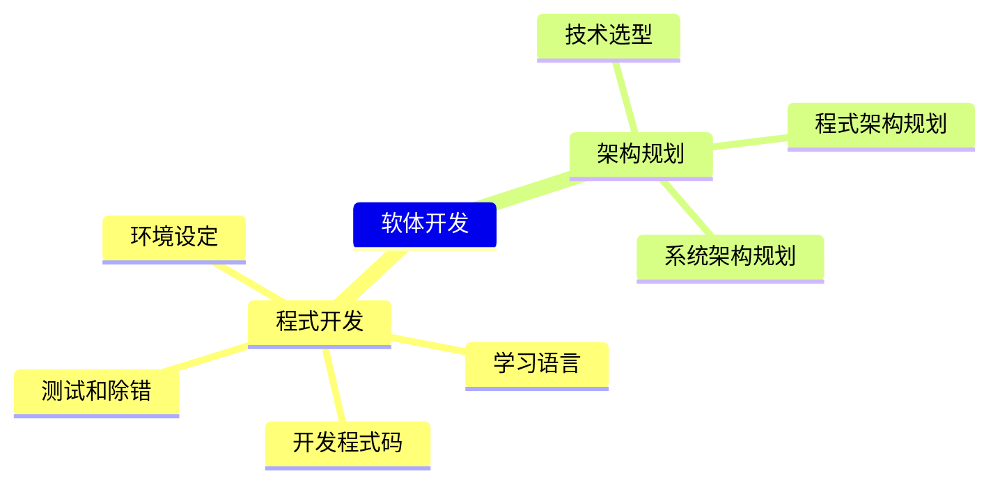

+++
title = "指令集: 与 ChatGPT 一起打造优质软体"
linkTitle = "软体开发"
weight = 3
+++

## 概念
开发程式的时候，我们需要做很多事情，包括设定环境、学习语言、撰写程式码、测试和除错等等。
这些工作需要花费大量的时间和精力，但如果我们善用人工智慧 (AI) 技术，就能够加速这些工作的完成。
例如，AI 可以帮助我们自动生成程式码、自动优化程式码、自动除错等等，这些功能能够大幅提升我们的开发效率和品质。
同时，AI 技术还可以帮助我们进行架构规划，选择最适合的技术和架构，提高系统的稳定性和可靠性。

## 心智图

## 用法与范例
- 程式开发
  - 环境设定
    - 范例：`如何在vscode中传入命令列参数进行Golang除错`
  - 学习语言
    - 学习语言特性
      - 范例：`使用程式码来解释Golang的workspace, module, package, internal package`      - 
    - 标准库使用
      - 范例：`如何使用Golang将字串存入档案`
    - 套件使用范例
      - 范例：`使用Goldmark剖析markdown字串并走访树状list`
  - 开发程式码
    - 撰写程式片段
      - 范例：`使用Golang递回走访资料夹，复制档案到另一个资料夹`
    - 优化程式码
      - 范例：`如何优化这段程式码使用的记忆体数量`
    - 理解并说明程式码内容
      - 范例：`说明这段程式的主要逻辑`
    - 撰写Regex
      - 范例：`撰写Regex来剖析以逗号分隔的CSV，此CSV的某些栏位包含逗号，并且以双引号环绕`
  - 测试和除错
    - 测试
      - 范例：`撰写五个测试案例，用来测试Golang命令列程式。此程式有两个参数，第一个参数需为[A, B, C]，第二个参数须为int`
    - 错误讯息除错
      - 范例：`此错误讯息原因为何，如何解决：cannot use x (type []int) as type []interface {} in argument to foo`
    - 程式码片段除错
      - 范例：`这段程式码无法成功读取档案，可能原因为何?`
- 架构规划
  - 技术选型
    - 范例：`推荐Golang剖析markdown的套件`
    - 范例：`比较Goldmark与Blackfriday`
    - 范例：`如果我需要读取markdown，并且使用自定义标记，应该使用什么Golang套件`
  - 程式架构规划
    - 范例：`Golang程式架构范例，需要有主程式、共用元件、私有元件、设定档、并处理多国语系资料`
  - 系统架构规划
    - 范例：`设计一个高可用性的Golang网站，有哪些需考虑的要素`

## 进阶学习
也可以向ChatGPT学习、回顾可以使用的进阶软体开发知识
Example
- [设计模式](https://learninfun.github.io/learn-with-ai/zh-tw/ai-knowledge-hub/it/back-end-development/design-pattern/)
- [演算法](https://learninfun.github.io/learn-with-ai/zh-tw/ai-knowledge-hub/it/back-end-development/algorithm/)
