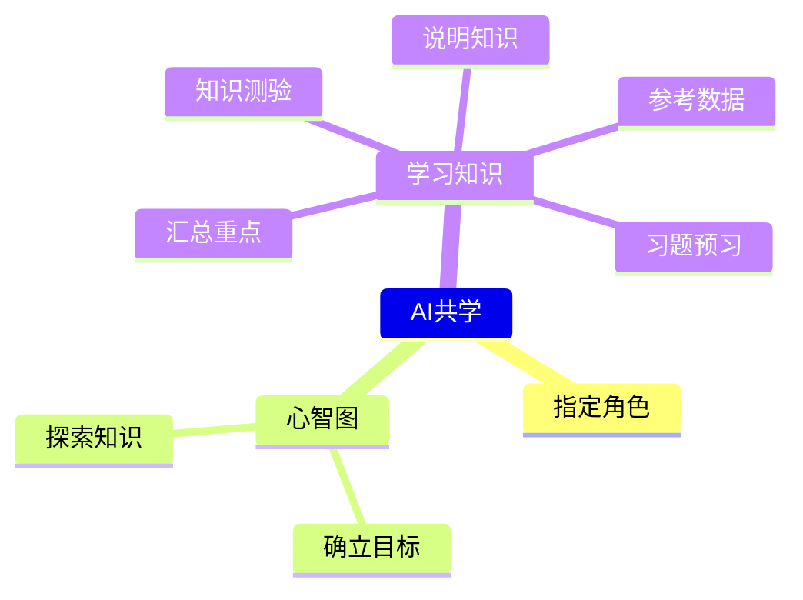

+++
title = "指令集: 与 ChatGPT 一起学习，强化你的知识技能"
linkTitle = "学习新知"
weight = 1
+++

## 概要说明

学习新知识是个漫长的过程，但是现在有AI技术可以帮助我们更有系统地学习。  
AI技术可以帮助我们找到最适合我们的学习资源、设计最有效的学习计划、提供有价值的答案和解决方案，甚至可以跟着我们的学习进度不断进行调整和优化。  
透过AI的辅助，我们能够更加有系统地学习新知识，并且更加高效地达成我们的学习目标。  

## 心智图

## 指令列表

- 设定角色: `假设你是[AA]专家，回答我[AA]相关问题`
- 探索知识: `请列出关于[AA]的知识点`
    - 展开知识: `请列出关于[AA.BB]的知识点`
    - 自动探索、展开知识: `帮我列出[AA]的知识点，以不重复的树状结构呈现，并往下展开到第五层`
- 学习知识
    - 习题预习: `给我5题[OO]的问题`
    - 说明知识: `说明[OO]并举例`
    - 汇总重点: `条列[OO]的重点`
    - 知识测验: `给我5题[OO]的中等难度问题，并在后面列出答案`
    - 参考数据: `给我5篇[OO]的网络数据`

## 指令使用范例

- 设定角色: `假设你是"营销"专家，回答相关问题`
- 探索知识: `请列出关于"网站营销"的知识点`
    - 展开知识: `请列出关于"SEO"的知识点`
    - 自动探索、展开知识: `帮我列出"网站营销"的知识点，以不重复的树状结构呈现，并往下展开到第五层`
- 学习知识
    - 习题预习: `给我5题关于"关键词搜索"的问题`
    - 说明知识: `说明"关键词搜索"并举例`
    - 汇总重点: `条列"关键词搜索"的重点`
    - 知识测验: `给我5题关于"关键词搜索"的中等难度问题，并在后面列出答案`
    - 网络数据: `给我5篇，有关"关键词搜索"的网络数据`
    
## 作法结果范例
如果觉得上述做法太抽象，可以参考下方使用的范例
- [学习财务知识](https://learninfun.github.io/learn-with-ai/zh-tw/ai-knowledge-hub/finance/)
- [学习软件开发](https://learninfun.github.io/learn-with-ai/zh-tw/ai-knowledge-hub/it/back-end-development/)

## 作法框架说明

### 1. 确立目标：
要学习一门新的知识体系，就像是探索一个充满未知的新大陆。在这个过程中，确定学习目标是非常重要的。这不仅有助于您建立一个明确的学习计划，还能帮助您选择要学习的主题。请确保您的目标具体，可测量和现实可行，这样您才能更好地衡量自己的进展和成功。始终保持目标明确，不断地朝着目标迈进，您就能更轻松地掌握新知识，并更加自信地应用于实际生活中。

### 2. 指定角色：

在使用ChatGPT学习特定知识时，建议指定相应的专业角色。指定角色可以提高问题精确度，帮助ChatGPT更好地理解您的问题并提供更准确的回答。例如，在学习程序设计相关知识时，您可以指定ChatGPT为「程序设计师」角色，这样ChatGPT能够更好地理解您的问题并提供相关的答案。
    
此外，指定角色还有助于ChatGPT根据您的学习需求提供相应的建议和资源，使学习更加个性化和高效。因此，在使用ChatGPT进行学习时，建议先考虑指定角色。
    
指令：`假设你是[AA]专家，回答我[AA]相关问题`  
范例：`假设你是"营销"专家，回答相关问题`  
    
### 3. 使用心智图进行知识定位与关联：
藉由心智图或树形图，您可以清楚地了解自己在知识体系中的位置和探索状况。不要忘记随时注意您的目前位置和不同区域的相对重要性。
您可以使用传统的纸笔方法来建立心智图，或是使用软件如MindNode、XMind和FreeMind等，这些软件都可以免费下载和使用。此外，许多网站也提供相关服务，例如Miro、Whimsical等，您也可以免费使用它们。

### 4. 探索知识：
建立知识点之间的关联，有助于大脑更好地理解、串连和记忆多个知识点。透过将知识点放在一起，使用心智图或树形图等工具将它们组织起来，可以更清晰地了解知识点之间的关系，并将它们放入更广泛的上下文中。这种方法还可以帮助您更快地掌握新知识，并提高对已有知识的记忆和理解。
    
**可能作法1：**
可以先将目前所学的知识点列出来，再细分成子知识点，进一步条列每个子知识点的内容，以此类推，直到达到想要深入钻研的颗粒度。这样做可以让学习者更清楚地了解每个知识点和子知识点之间的关系，并且慢慢地建立起知识的骨架。
    
指令：`请列出关于[AA]的知识点`  
范例：`请列出关于"网站营销"的知识点`  
    
**可能作法2：**
可以请chatGPT直接以树状展开知识点之间的关联，这样可以节省时间，快速地建立起知识骨架。不过需要注意的是，这种方式的展开内容可能会较不固定，因为chatGPT展开的内容可能会受到不同因素的影响，例如搜寻关键词、范围等等。因此，在使用这种方式时，建议学习者仍需仔细检查展开的内容，以确保其正确性和完整性。
    
指令：`帮我列出[AA]的知识点，以不重复的树状结构呈现，并往下展开到第五层`  
范例：`帮我列出"网站营销"的知识点，以不重复的树状结构呈现，并往下展开到第五层`  
    
### 5. 深入学习：
以下是几个建议的步骤，可以协助您更深入地理解和掌握该知识点  

**1. 预习习题以了解知识点的重点，可以更有目的地学习知识**  

指令：`给我5题关于[OO]的问题`  
范例：`给我5题关于"关键词搜索"的问题`  
    
**2. 说明知识内容并举例，以了解知识点的细节和实际应用**  

指令：`说明[OO]并举例`    
范例：`说明"关键词搜索"并举例`  
    
**3. 条列知识内容重点，以进行汇总，将知识点内容条理清晰，更有助于理解和记忆**  

指令：`条列[OO]的重点`  
范例：`条列"关键词搜索"的重点`  
    
**4. 测验知识内容重点，以快速获得目前的了解程度反馈，发现自己需要再多加强哪些方面**  

指令：`给我5题关于[OO]的中等难度问题，并在后面列出答案`  
范例：`给我5题关于"关键词搜索"的中等难度问题，并在后面列出答案`  
    
**5. 条列更多参考数据，以进行衍伸阅读，并验证chatGPT所描述的内容是否正确，同时扩展知识面，从更多的资料中学习，达到更深入的理解**  

指令：`列出关于[OO]的相关介绍网页`  
范例：`列出关于"关键词搜索"的相关介绍网页`  
    
### 6. 钻研或移动：
在学习的过程中，建立心智图可以帮助我们将知识点组织成有条理的结构，并且清楚地理解每个知识点的重要性和相互关系。  
透过心智图，我们可以判断目前的学习位置，进而决定要继续深入研究该知识点，或是移到其他知识点进行学习。  
除此之外，心智图也可以帮助我们记忆和复习所学的知识，因为我们可以透过心智图中的图像、文字、颜色等元素，轻松地回想起所学的知识点和相关的细节。

## 结论与衍伸做法

这个学习框架提供了一个系统性、全面性的学习方法，涵盖了自我评估、目标设定、知识点掌握、深入学习和衍伸学习等方面。  
透过这个学习框架，你可以更有效率地学习，建立深度理解和知识链接，以及培养自我学习的能力。  

但还有其他可能的学习方式可以自行扩充。以下是更多的学习策略，可帮助您更好地理解和记忆知识：  

1. 建立知识点间的关联：可以使用之前建立的心智图或树形图，找到关联性高的知识点进行整合，以进行综合学习。
2. 从不同角度向ChatGPT询问知识点，增加理解的深度。将问题从不同的角度出发，可以帮助您更全面地理解知识点。
3. 请尝试将知识点中的主要想法和论点自行归纳出来，自己说一次，最能够建立记忆。透过口语和书面的方式，能够协助您更好地记忆和理解知识。
4. 找到一些入门书籍或文章，从基础知识开始学习，再进行更深入的研究。从基础知识开始，可以逐步深入理解更复杂的概念和知识点。
5. 使用多种媒体，例如视频、音频和图像，以帮助您更好地理解和记忆知识。透过多种媒体形式，可以更有趣地学习并深入理解知识。
6. 大量练习。练习能够协助您更好地理解和应用所学的知识。
7. 与他人讨论：和他人讨论知识点，分享不同的理解和观点，往往能够启发新的想法和思路。与他人讨论，可以帮助您更全面地理解和应用所学的知识。
8. 实际应用：将所学应用到实际生活中，例如透过项目、比赛、实习等方式，能够深入了解和巩固所学。
9. 反思与回顾：在学习的过程中，定期进行反思和回顾，审视自己的学习效果和学习方法是否需要
