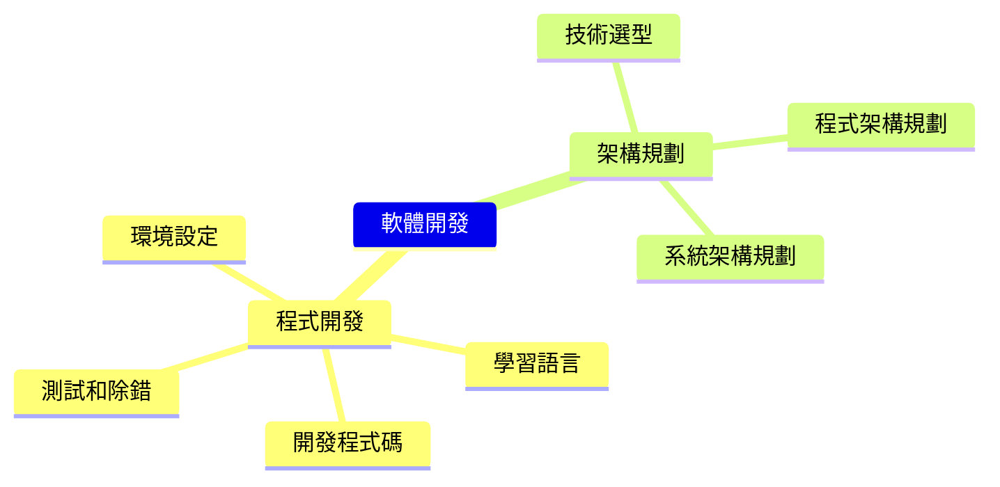

+++
title = "AI協同軟體開發"
weight = 2
+++

## 概念
開發程式的時候，我們需要做很多事情，包括設定環境、學習語言、撰寫程式碼、測試和除錯等等。
這些工作需要花費大量的時間和精力，但如果我們善用人工智慧 (AI) 技術，就能夠加速這些工作的完成。
例如，AI 可以幫助我們自動生成程式碼、自動優化程式碼、自動除錯等等，這些功能能夠大幅提升我們的開發效率和品質。
同時，AI 技術還可以幫助我們進行架構規劃，選擇最適合的技術和架構，提高系統的穩定性和可靠性。

## 心智圖

## 用法與範例
- 程式開發
  - 環境設定
    - 範例：`如何在vscode中傳入命令列參數進行Golang除錯`
  - 學習語言
    - 學習語言特性
      - 範例：`使用程式碼來解釋Golang的workspace, module, package, internal package`      - 
    - 標準庫使用
      - 範例：`如何使用Golang將字串存入檔案`
    - 套件使用範例
      - 範例：`使用Goldmark剖析markdown字串並走訪樹狀list`
  - 開發程式碼
    - 撰寫程式片段
      - 範例：`使用Golang遞迴走訪資料夾，複製檔案到另一個資料夾`
    - 優化程式碼
      - 範例：`如何優化這段程式碼使用的記憶體數量`
    - 理解並說明程式碼內容
      - 範例：`說明這段程式的主要邏輯`
    - 撰寫Regex
      - 範例：`撰寫Regex來剖析以逗號分隔的CSV，此CSV的某些欄位包含逗號，並且以雙引號環繞`
  - 測試和除錯
    - 測試
      - 範例：`撰寫五個測試案例，用來測試Golang命令列程式。此程式有兩個參數，第一個參數需為[A, B, C]，第二個參數須為int`
    - 錯誤訊息除錯
      - 範例：`此錯誤訊息原因為何，如何解決：cannot use x (type []int) as type []interface {} in argument to foo`
    - 程式碼片段除錯
      - 範例：`這段程式碼無法成功讀取檔案，可能原因為何?`
- 架構規劃
  - 技術選型
    - 範例：`推薦Golang剖析markdown的套件`
    - 範例：`比較Goldmark與Blackfriday`
    - 範例：`如果我需要讀取markdown，並且使用自定義標記，應該使用什麼Golang套件`
  - 程式架構規劃
    - 範例：`Golang程式架構範例，需要有主程式、共用元件、私有元件、設定檔、並處理多國語系資料`
  - 系統架構規劃
    - 範例：`設計一個高可用性的Golang網站，有哪些需考慮的要素`

## 進階學習
也可以向ChatGPT學習、回顧可以使用的進階軟體開發知識
Example
- [設計模式](https://learninfun.github.io/learn-with-ai/zh-tw/ai-knowledge-hub/it/back-end-development/design-pattern/)
- [演算法](https://learninfun.github.io/learn-with-ai/zh-tw/ai-knowledge-hub/it/back-end-development/algorithm/)
