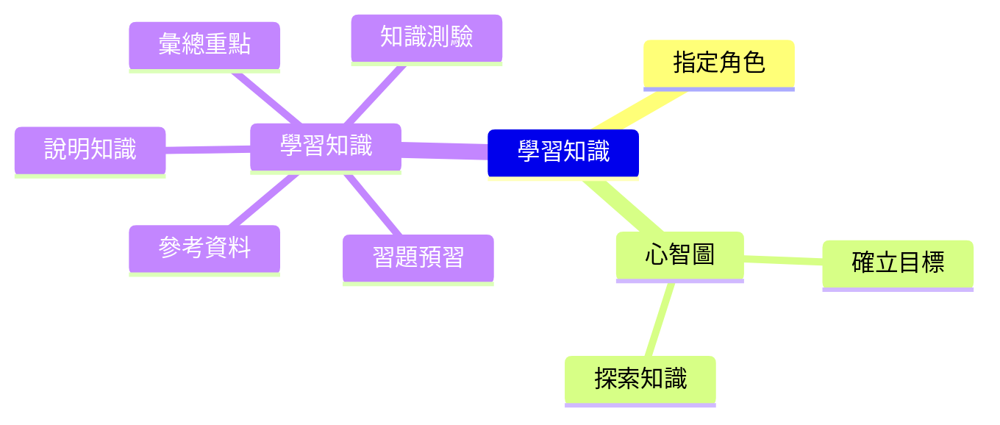

+++
title = "AI協同學習"
+++

## 概要說明

ChatGPT是一款強大的語言模型，它可以回答您的問題、提供有價值的知識，甚至可以作為您學習新知識的助手。
但是，如何有系統的使用ChatGPT學習一門知識呢？以下是一些簡單易行的方法，幫助您更有效率地利用ChatGPT學習

## 心智圖

## 指令清單

- 設定角色: `假設你是[OO]專家，回答我[OO]相關問題`
- 探索知識: `請列出關於[OO]的知識點`
    - 展開知識: `請列出關於[OO.AA]的知識點`
        - 繼續展開知識: `請列出關於[OO.AA.BB]的知識點`
    - 自動探索、展開知識: `幫我列出[OO]的知識點，以不重複的樹狀結構呈現，並往下展開到第五層`
- 學習知識
    - 習題預習: `給我5題[CC]的問題`
    - 說明知識: `說明[CC]並舉例`
    - 彙總重點: `條列[CC]的重點`
    - 知識測驗: `給我5題[CC]的中等難度問題，並在後面列出答案`
    - 參考資料: `給我5篇[CC]的網路資料`

## 指令使用範例

- 設定角色: `假設你是"財務"專家，回答我"財務"相關問題`
- 探索知識: `請列出關於"投資"的知識點`
    - 展開知識: `請列出關於"投資組合"的知識點`
        - 繼續展開知識: `請列出關於"投資組合策略"的知識點`
    - 自動探索、展開知識: `幫我列出"個人財務規劃"的知識點，以不重複的樹狀結構呈現，並往下展開到第五層`
- 學習知識
    - 習題預習: `給我5題關於"價值投資"的問題`
    - 說明知識: `說明"價值投資"並舉例`
    - 彙總重點: `條列"價值投資"的重點`
    - 知識測驗: `給我5題關於"價值投資"的中等難度問題，並在後面列出答案`
    - 網路資料: `給我5篇，有關"價值投資"的網路資料`
    

## 作法框架說明

### 1. 確立目標：
要學習一門新的知識體系，就像是探索一個充滿未知的新大陸。在這個過程中，確定學習目標是非常重要的。這不僅有助於您建立一個明確的學習計劃，還能幫助您選擇要學習的主題。請確保您的目標具體，可測量和現實可行，這樣您才能更好地衡量自己的進展和成功。始終保持目標明確，不斷地朝著目標邁進，您就能更輕鬆地掌握新知識，並更加自信地應用於實際生活中。

### 2. 指定角色：

在使用ChatGPT學習特定知識時，建議指定相應的專業角色。指定角色可以提高問題精確度，幫助ChatGPT更好地理解您的問題並提供更準確的回答。例如，在學習程式設計相關知識時，您可以指定ChatGPT為「程式設計師」角色，這樣ChatGPT能夠更好地理解您的問題並提供相關的答案。
    
此外，指定角色還有助於ChatGPT根據您的學習需求提供相應的建議和資源，使學習更加個性化和高效。因此，在使用ChatGPT進行學習時，建議先考慮指定角色。
    
指令：`假設你是[OO]專家，回答我[OO]相關問題`  
範例：`假設你是"財務"專家，回答我"財務"相關問題`  
    
### 3. 使用心智圖進行知識定位與關聯：
藉由心智圖或樹狀圖，您可以清楚地了解自己在知識體系中的位置和探索狀況。不要忘記隨時注意您的目前位置和不同區域的相對重要性。
您可以使用傳統的紙筆方法來建立心智圖，或是使用軟體如MindNode、XMind和FreeMind等，這些軟體都可以免費下載和使用。此外，許多網站也提供相關服務，例如Miro、Whimsical等，您也可以免費使用它們。

### 4. 探索知識：
建立知識點之間的關聯，有助於大腦更好地理解、串連和記憶多個知識點。透過將知識點放在一起，使用心智圖或樹狀圖等工具將它們組織起來，可以更清晰地了解知識點之間的關係，並將它們放入更廣泛的上下文中。這種方法還可以幫助您更快地掌握新知識，並提高對已有知識的記憶和理解。
    
**可能作法1：**
可以先將目前所學的知識點列出來，再細分成子知識點，進一步條列每個子知識點的內容，以此類推，直到達到想要深入鑽研的顆粒度。這樣做可以讓學習者更清楚地了解每個知識點和子知識點之間的關係，並且慢慢地建立起知識的骨架。
    
指令：`請列出關於[OO]的知識點`  
範例：`請列出關於"個人財務規劃"的知識點`  
    
**可能作法2：**
可以請chatGPT直接以樹狀展開知識點之間的關聯，這樣可以節省時間，快速地建立起知識骨架。不過需要注意的是，這種方式的展開內容可能會較不固定，因為chatGPT展開的內容可能會受到不同因素的影響，例如搜尋關鍵字、範圍等等。因此，在使用這種方式時，建議學習者仍需仔細檢查展開的內容，以確保其正確性和完整性。
    
指令：`幫我列出[OO]的知識點，以不重複的樹狀結構呈現，並往下展開到第五層`  
範例：`幫我列出"個人財務規劃"的知識點，以不重複的樹狀結構呈現，並往下展開到第五層`  
    
### 5. 深入學習：
以下是幾個建議的步驟，可以協助您更深入地理解和掌握該知識點  

**1. 預習習題以了解知識點的重點，可以更有目的地學習知識**  

指令：`給我5題關於[CC]的問題`  
範例：`給我5題關於"價值投資"的問題`  
    
**2. 說明知識內容並舉例，以了解知識點的細節和實際應用**  

指令：`說明[CC]並舉例`    
範例：`說明"價值投資"並舉例`  
    
**3. 條列知識內容重點，以進行彙總，將知識點內容條理清晰，更有助於理解和記憶**  

指令：`條列[CC]的重點`  
範例：`條列"價值投資"的重點`  
    
**4. 測驗知識內容重點，以快速獲得目前的了解程度反饋，發現自己需要再多加強哪些方面**  

指令：`給我5題關於[CC]的中等難度問題，並在後面列出答案`  
範例：`給我5題關於"價值投資"的中等難度問題，並在後面列出答案`  
    
**5. 條列更多參考資料，以進行衍伸閱讀，並驗證chatGPT所描述的內容是否正確，同時擴展知識面，從更多的資料中學習，達到更深入的理解**  

指令：`列出關於[CC]的相關介紹網頁`  
範例：`列出關於"價值投資"的相關介紹網頁`  
    
### 6. 鑽研或移動：
在學習的過程中，建立心智圖可以幫助我們將知識點組織成有條理的結構，並且清楚地理解每個知識點的重要性和相互關係。  
透過心智圖，我們可以判斷目前的學習位置，進而決定要繼續深入研究該知識點，或是移到其他知識點進行學習。  
除此之外，心智圖也可以幫助我們記憶和複習所學的知識，因為我們可以透過心智圖中的圖像、文字、顏色等元素，輕鬆地回想起所學的知識點和相關的細節。

## 結論與衍伸做法

這個學習框架提供了一個系統性、全面性的學習方法，涵蓋了自我評估、目標設定、知識點掌握、深入學習和衍伸學習等方面。  
透過這個學習框架，你可以更有效率地學習，建立深度理解和知識連結，以及培養自我學習的能力。  

但還有其他可能的學習方式可以自行擴充。以下是更多的學習策略，可幫助您更好地理解和記憶知識：  

1. 建立知識點間的關聯：可以使用之前建立的心智圖或樹狀圖，找到關聯性高的知識點進行整合，以進行綜合學習。
2. 從不同角度向ChatGPT詢問知識點，增加理解的深度。將問題從不同的角度出發，可以幫助您更全面地理解知識點。
3. 請嘗試將知識點中的主要想法和論點自行歸納出來，自己說一次，最能夠建立記憶。透過口語和書面的方式，能夠協助您更好地記憶和理解知識。
4. 找到一些入門書籍或文章，從基礎知識開始學習，再進行更深入的研究。從基礎知識開始，可以逐步深入理解更複雜的概念和知識點。
5. 使用多種媒體，例如視頻、音頻和圖像，以幫助您更好地理解和記憶知識。透過多種媒體形式，可以更有趣地學習並深入理解知識。
6. 大量練習。練習能夠協助您更好地理解和應用所學的知識。
7. 與他人討論：和他人討論知識點，分享不同的理解和觀點，往往能夠啟發新的想法和思路。與他人討論，可以幫助您更全面地理解和應用所學的知識。
8. 實際應用：將所學應用到實際生活中，例如透過專案、比賽、實習等方式，能夠深入了解和鞏固所學。
9. 反思與回顧：在學習的過程中，定期進行反思和回顧，審視自己的學習效果和學習方法是否需要
